# 真机远程调试方法汇总
是指用桌面电脑（PC或MAC）远程连接上移动设备，通过类似Chrome浏览器开发人员工具的界面，来调试移动设备上运行的网页

## Chrome模拟器
1、在PC或MAC上打开Chrome浏览器，打开想要调试的页面，然后打开开发人员工具

2、点击开发人员工具顶栏上的手机图标，即可开始调试，一般来说需要重新刷新页面

3、在页面顶部可以看到设备选择下拉菜单 Device 和 模拟网络环境的下拉菜单 Network

## 调试Android APP里的webview
1、开启当前Android设备的USB调试（ 示意图 ）
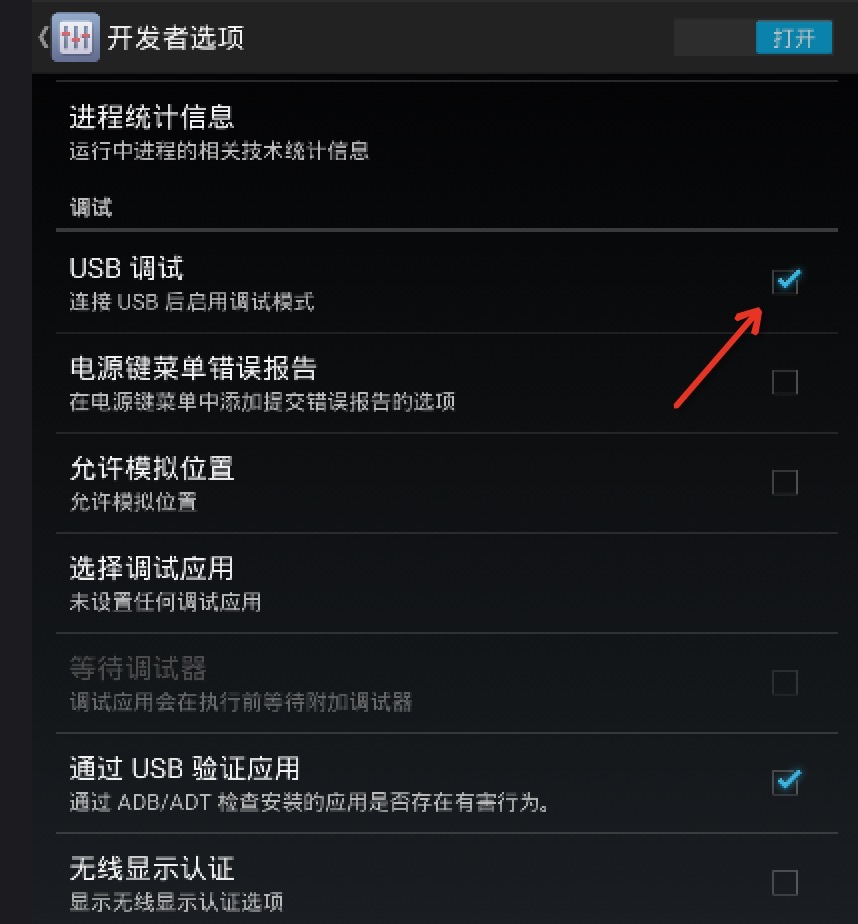

2、在PC或MAC上安装chrome浏览器（版本>=32）和对应的Android设备驱动

3、用USB线连接Android设备，在PC或MAC上的chrome地址栏输入 chrome://inspect 然后回车，或通过菜单图标→工具→检查设备，进入调试界面（ 示意图 ）
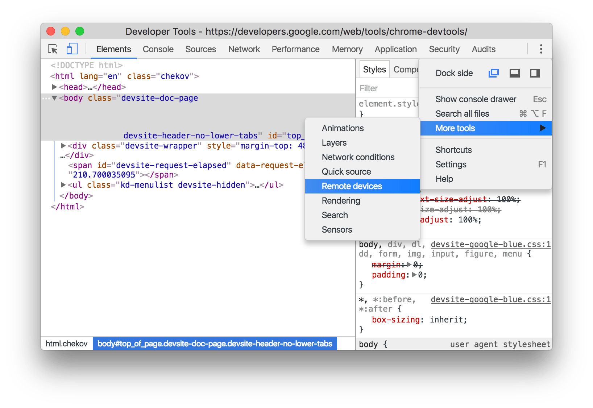

4、勾选界面中的 Discover USB devices ，直到搜索到你的Android设备（ 示意图 ）
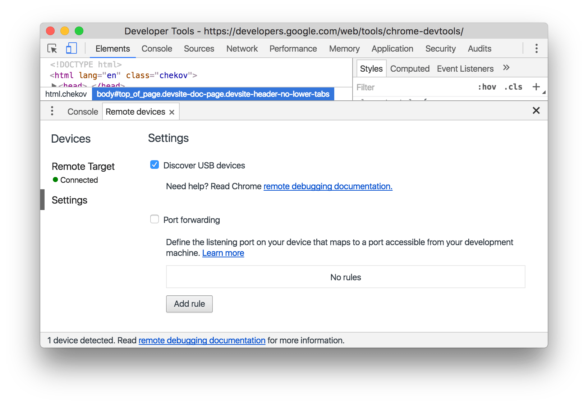

5、在移动设备上弹出的是否允许远程调试上，选择“允许”

6、在下面的页面列表（将展示已在Android上的chrome中打开的页面），点击对应的 inspect 开始调试（ 示意图 ）
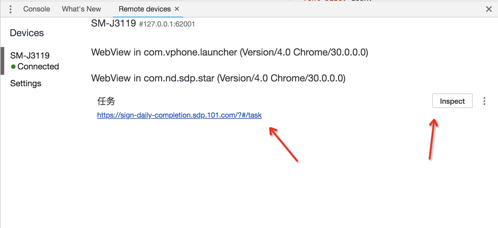

7、此时将在桌面版Chrome上弹出一个新的标签页，即为调试界面；如果很久都没用响应，请翻墙后再试（一个免费的翻墙工具：[ ishadowx ](https://my.ishadowx.net/)）（ 示意图 ）
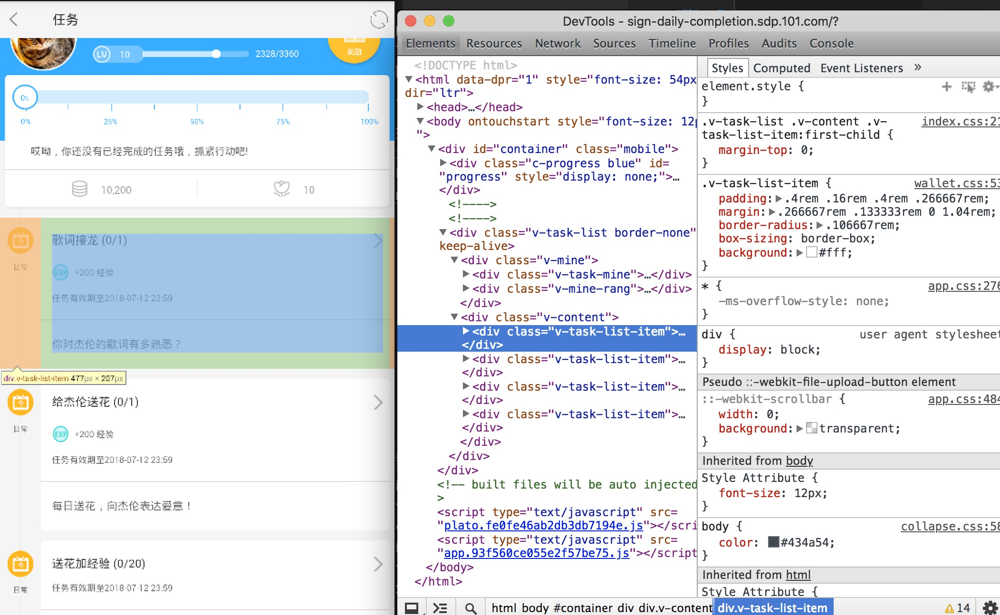

## 调试iOS上的Safari
1、在iOS设备上打开允许调试：设置→Safari→高级→打开”web检查器“（ 示意图 ）
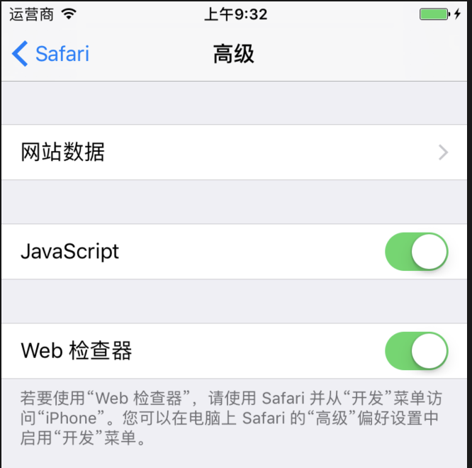

2、在MAC上打开Safari的开发菜单：顶部菜单栏“Safari”→偏好设置→高级→打开”在菜单栏中显示“开发”菜单（ 示意图 ）
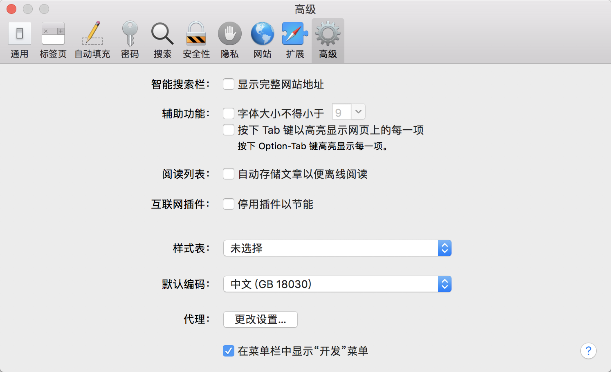

3、在iOS设备上的Safari浏览器中打开要调试的页面，然后切换到MAC的Safari，在顶部菜单栏选择“开发”→找到你的iOS设备名称→右边二级菜单选择需要调试的对应标签页，即可开始远程调试（ 示意图 ）
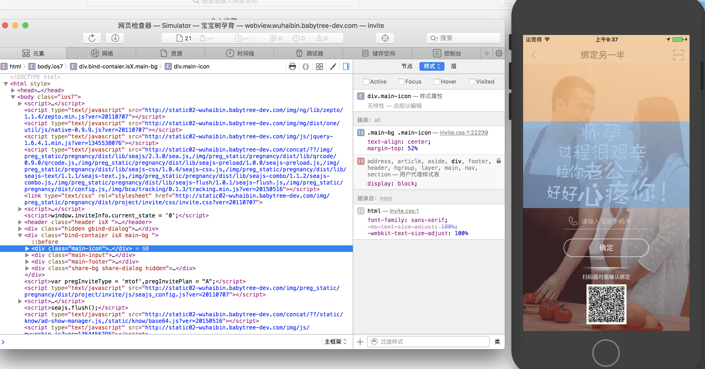

4、如果没有iOS设备，也可以在Xcode中模拟一台，点击顶部“Xcode”→“Open Developer Tool”→“iOS Simulator”即可打开一个iOS设备的模拟器，并且模拟器里面Safari打开的页面，也是能通过上个步骤中MAC上的Safari调试。

## weinre
过程稍微繁琐，但是这个方案能调试几乎所有平台的所有浏览器，只要能运行js的就行

1、 安装nodejs 

2、 安装weinre到global，即在命令行中运行 npm -g install weinre （MAC可能需要在前面加上 sudo ）

3、获取本机IP地址（PC：开始→运行→cmd，输入 ipconfig ，查看“IPv4地址”字段； MAC：在网络偏好设置内）

4、 在命令行运行weinre： weinre --boundHost IP ，其中IP地址为上一步所获取的地址

6、 在PC或MAC上用浏览器打开 http://IP:8080/client/#anonymous ，其中IP地址为第三步所获取的地址（ 示意图 ）
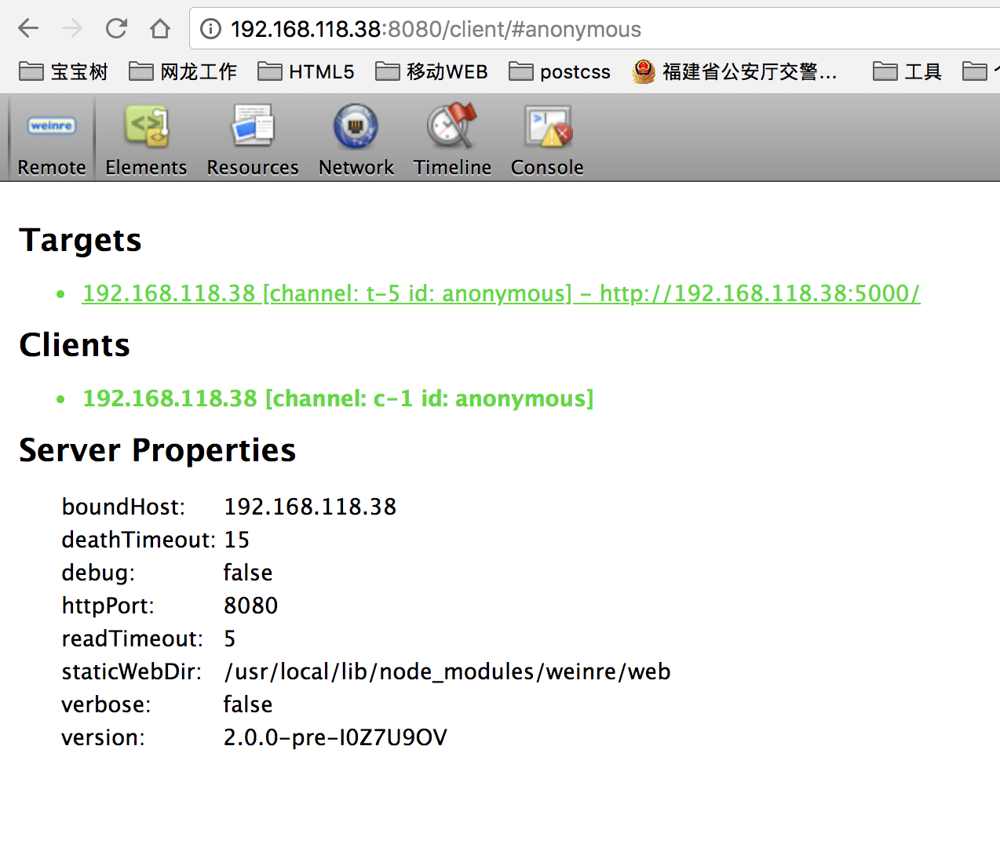

7、 将移动设备连接到与PC或MAC同一局域网，把需要调试的页面上加上这段脚本,然后打开该网页 （ 示例 ）
```js
<script src="http://IP:8080/target/target-script.js"></script>
```

8、在PC或MAC上用浏览器打开 http://IP:8080/client/#anonymous的网页就可以看到移动端打开的网页的地址，选中它即可以对其进行调试 （ 示意图 ）
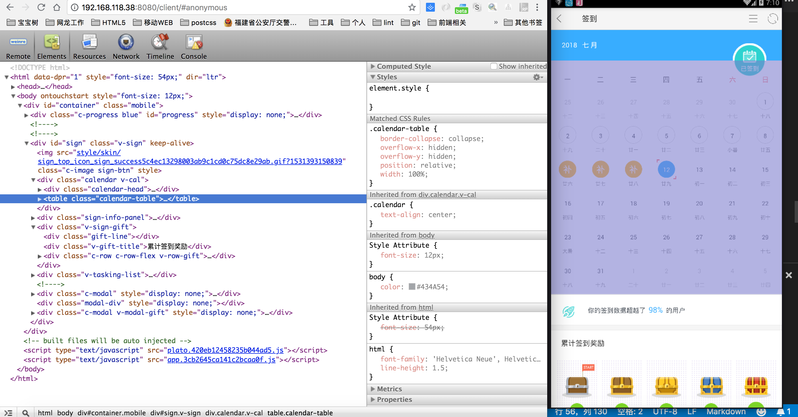

## spy-debugger(集成weinre)
内部集成了weinre，简化了weinre繁琐的配置过程。通过代理的方式拦截所有html自动注入weinre所需的js代码。

1、 安装
Windows: npm install spy-debugger -g
Mac: sudo npm install spy-debugger -g

2、 手机和PC保持在同一网络下（比如同时连到一个Wi-Fi下）

3、 命令行输入spy-debugger，按命令行提示用浏览器打开相应地址。

4、 设置手机的HTTP代理，代理IP地址设置为PC的IP地址，端口为spy-debugger的启动端口。

5、 用手机浏览器访问你要调试的页面即可。（ 示意图 ）
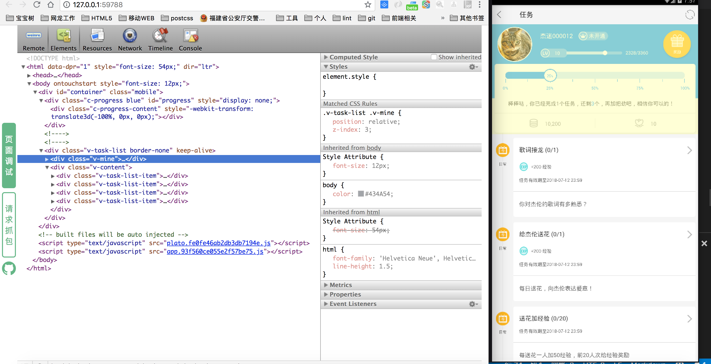

## Eruda
通过CDN使用：
```js
<script src="//cdn.bootcss.com/eruda/1.4.2/eruda.min.js"></script>
<script>eruda.init();</script>
```

通过npm安装：
```js
npm install eruda --save
```
在页面中加载脚本：
```js
<script src="node_modules/eruda/eruda.min.js"></script>
<script>eruda.init();</script>
```
（ 示意图 ）

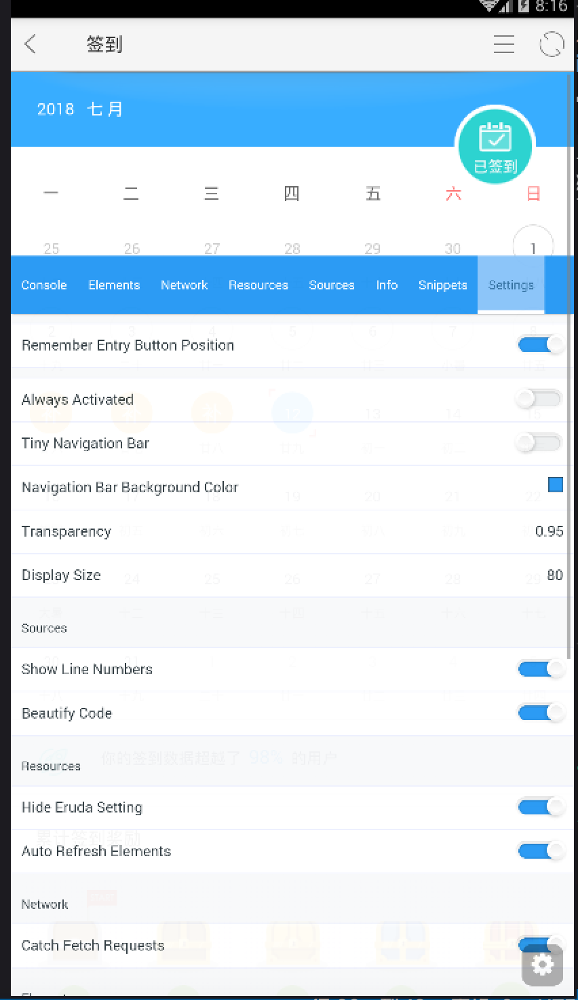